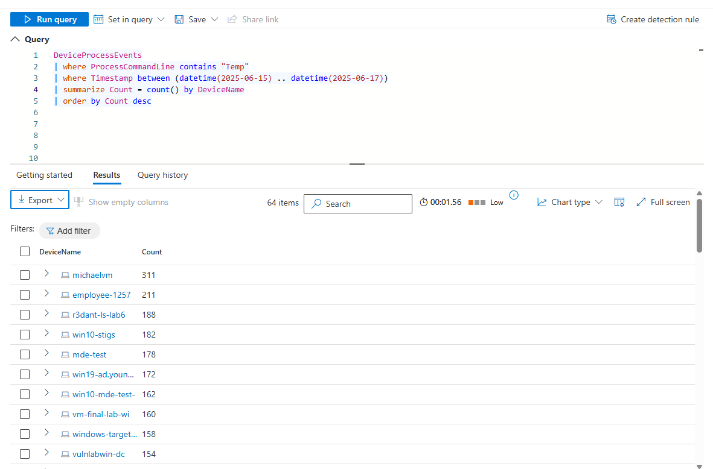

## ✅ Conclusion
Based on the query results,

```kusto
DeviceProcessEvents
| where ProcessCommandLine contains "Temp"
| where Timestamp between (datetime(2025-06-15) .. datetime(2025-06-17))
| summarize Count = count() by DeviceName
| order by Count desc
```


The machine with the highest number of executions from the Temp folder during the suspicious timeframe is:

**`michaelvm`** with **311** events.

This is the first machine to investigate in the cyber threat hunt.

## 📎 Supporting Evidence

To support the identification of `michaelvm` as the first machine to investigate, the following artifacts have been included:

🖼️ **Screenshot**: A visual capture of the query results showing the number of Temp folder executions per device between June 15–17, 2025. This screenshot highlights `michaelvm` at the top of the list with 311 events.

📊 [**Excel Sheet**](https://github.com/SruthinagaK/ThreatHunt-Lurker/blob/main/Flag%200.csv) This allows for further analysis and verification of the execution counts across devices.

These artifacts provide visual and tabular confirmation of the suspicious activity on `michaelvm`, reinforcing its selection as the initial point of investigation in this threat hunt.

The link to go back to the  [scenario](https://github.com/SruthinagaK/ThreatHunt-Lurker)
